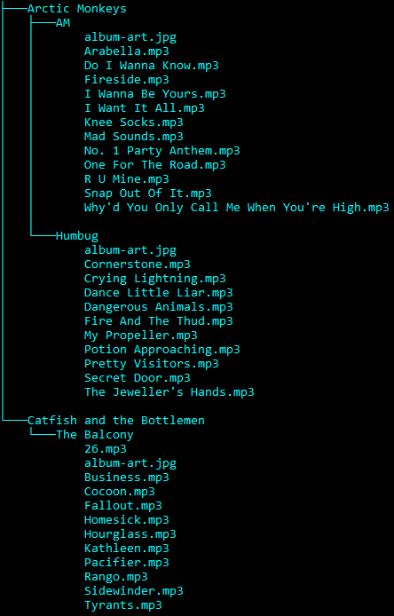
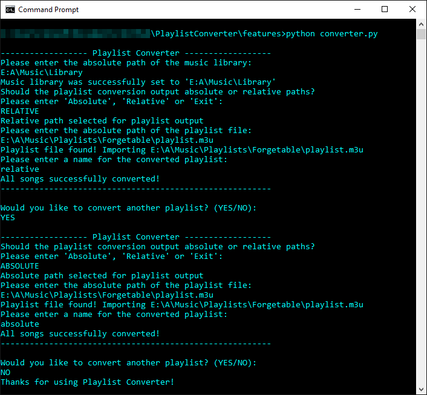
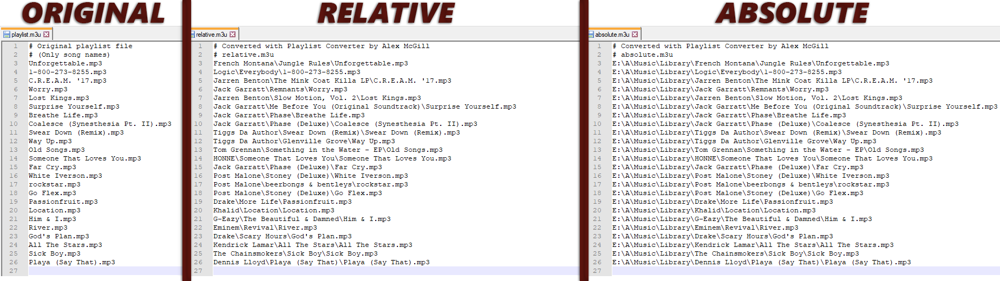

# PlaylistConverter
> Converts .m3u files that only have song names to the actual location of each song in a music library

## Features

* Absolute File Location Playlist Conversion
* Relative File Location Playlist Conversion 

## Dependencies
* [eye3D](https://eyed3.readthedocs.io/en/latest/) | Used for MP3 file metadata


## Requirements

* [Python 3.7](https://www.python.org/downloads/release/python-370/)
* A Music Library Structure of [Artist/Album/Song] as shown below:




## Usage

### Windows Command Prompt:
* (optional) | Add Python to path so 'python' command works regardless of currenty directory: 
```
set PATH=%PATH%;<...>\Programs\Python\Python37
```

* Set the current directory to the location of the converter and run the converter:
```
python converter.py
```


## Demo

### Program:


### Output:


## Meta

Distributed under the [MIT license](https://choosealicense.com/licenses/mit/). See ``LICENSE`` for more information.

Author [@mcgill-a](https://github.com/mcgill-a)
